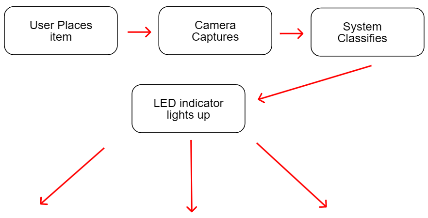
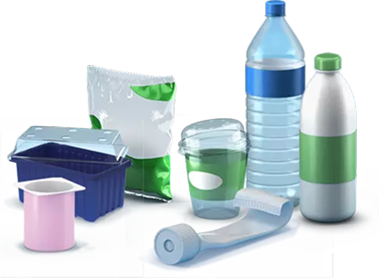

<div align="center">


**Intelligent Recycling System**
<br><br><br><br>


</div>

---
<br><br><br><br>


> *"Many people want to recycle — they just don't know where to start."*

**Smart Trash** is an intelligent waste classification system designed for **schools and public spaces**. It removes the guesswork from recycling by automatically identifying waste type and guiding users to the correct bin — in real time, with zero friction.

No apps to download. No manual sorting. Just put your waste in front of the system, and let it do the thinking.

---
<br><br>


<div align="center">
  
  <br>
  
  
  
</div>

The process is completely seamless — from detection to classification in seconds.

---
<br><br>


| Layer | Technology |
|---|---|
| Hardware | Arduino |
| Vision | Camera Sensor |
| Processing | Python |
| Analytics | Custom Stats App |
| Output | LED Indicator System |

---
<br><br>


The system currently detects and classifies:

| Category | Examples |
|---|---|
| Plastic | bottles, packaging, containers |
| Paper | cardboard, documents, wrappers |
| Metal | cans, foil, metal pieces |

---
<br><br>


Smart Trash was built with a clear mission:

| Goal | |
|---|---|
| Reduce environmental pollution | through better waste separation |
| Educate communities | by making recycling intuitive and accessible |
| Track recycling habits | with real-time statistics via the companion app |

---
<br><br>


```
v1.0  ── Current ──  Sensor + camera classification + LED guidance
  │
  └── v2.0  ── Planned ──  AI-powered model with expanded waste categories
                            Mobile app integration
                            Cloud statistics dashboard
```

---
<br><br>


> *Setup instructions coming soon. Hardware assembly guide and code deployment docs in progress.*

---
<br><br><br><br><br><br><br>
<div align="center">

</div>

<br><br>

<table align="center">
  <tr>
    <td align="center">
      <a href="https://github.com/AndresMorcilla">
        
        <br/>
        <sub><b>Andrés</b></sub>
      </a>
    </td>
    <td align="center">
      <a href="https://github.com/JoaquinRomero7429">
        
        <br/>
        <sub><b>Joaquín</b></sub>
      </a>
    </td>
    <td align="center">
      <a href="https://github.com/maximosando">
        
        <br/>
        <sub><b>Maximo</b></sub>
      </a>
    </td>
  </tr>
</table>

---

<div align="center">

**Smart Trash** — *Because the planet deserves smarter bins.*
<br>2026

</div>
